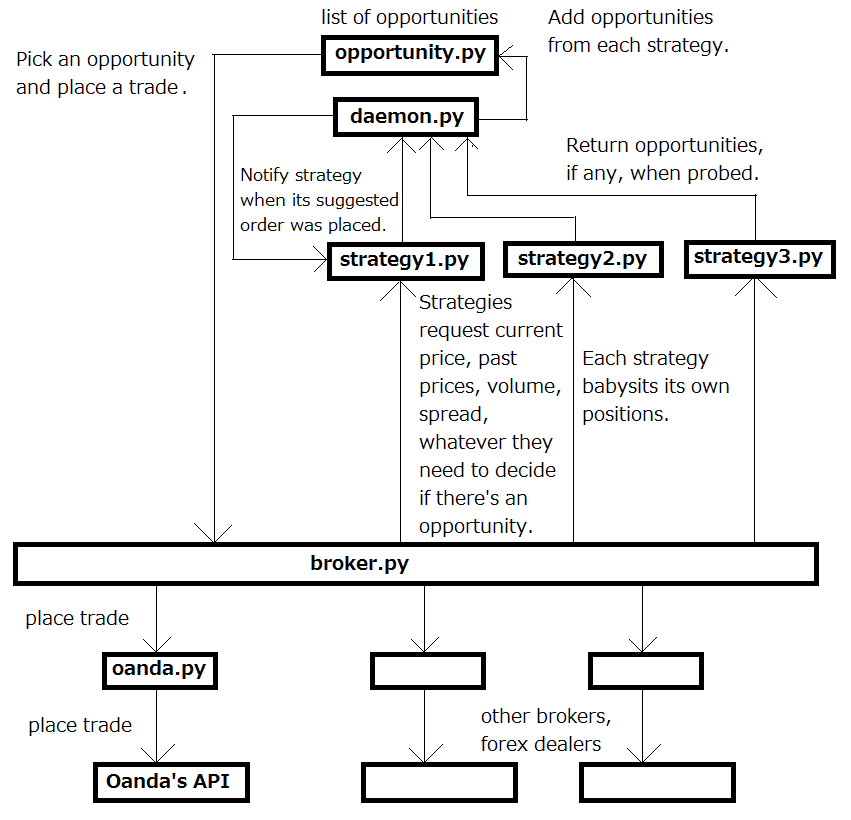
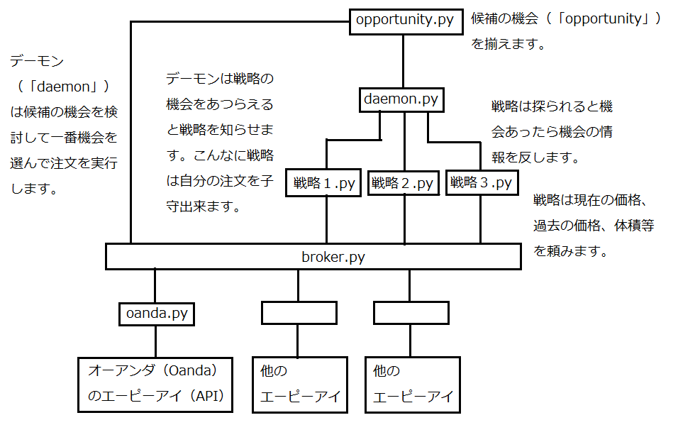

（日本語下記）

---

# Algorithmic Trading Daemon ("algo")

## Introduction

- This is a work in progress. As of 2017-02-17, live trading and forward testing are being coded. Backtesting is mostly non-existent. 
- It is a command line application for Linux. The Debian operating system is being used for development.
- Python is used for the bulk of the program currently (`/src/`). The database is MySQL (`/src/db/`). There are some shell scripts in `/src/scripts`.
- There are three pieces to this project, as with any algorithmic trading: backtesting, forward testing, and live trading.

## Backtesting
- Backtesting will consist of a MySQL database with historical data. The daemon iterates through the historical data to simulate live trading.
- The backtesting modules will use a strategy module as it is, so that strategy modules are blind to whether they are being used for backtesting or live trading. This eliminates the need to re-write strategy code for backtesting versus live trading.

## Forward Testing
- Same as live trading, except fake money is used.
- The "practice" variable in the config file is toggled to `True`.

## Live Trading
- The main program is referred to as a "daemon" because ideally it will be 100% self-sufficient. It exists in `/src/daemon.py`.
- The daemon is started like this: `$ python3 daemon.py`.
- Each strategy gets its own module. For example, the `/src/strategies/fifty.py` module encapsulates one simple strategy.

## Platform Design: Scalability and Modularity
- Scalability and user-friendliness take priority over speed. This is not intended to be used for high-frequency trading.
- The strategy modules can be used (or not used) arbitrarily. Only trivial changes need to be made to the code to add or remove strategy modules. Currently you can only choose strategies when the platform is not running, but hopefully the strategies will be "hot-swappable" in the future.
- Strategy modules can be used for backtesting, forward testing, and live trading with only trivial changes to the code.
- `daemon.py` and the strategy modules make calls to `broker.py` which makes calls to a broker-specific module specified in the config file. Having the generic `broker.py` layer allows the broker/dealer to be changed arbitrarily by only changing one line in the config file. 
- The daemon is intended to handle any number of strategies at any given time. It is responsible for managing margin, account balance, order size, diversification, and other considerations when placing orders. If the strategies were responsible for those things, then they would have to communicate with each other. That would introduce unnecessary complexity.

---

# アルゴリズミックトレーディングボット（「アルゴ」）
仕掛品。    

三つ部分：（１）バックテスティング（２）フォーワードテスティング（３）③　ライブトレーディング

## バックテスティング
MySQLでの過去の価格のデーターでシミュレーションを行うつもりです。

## フォーワードテスティング
作り物のお金の以外、ライブトレーディングと同じです。

## ライブトレーディング
自動売買。実行をし方法： `$ python3 daemon.py`

## デザイン
スケーラビリティとモジュール性と使い勝手は高優先です。速度は低順位です。

---

