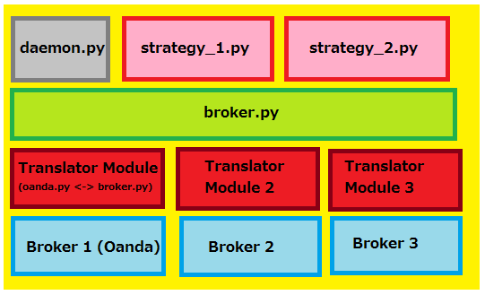

# Algorithmic Trading Daemon ("algo")

## Introduction
- This is a work in progress. As of 2017-12-30, live trading and forward testing are being coded. Backtesting is mostly non-existent. 
- It is a command line application for Linux. The Debian operating system is being used for development.
- Python is used for the bulk of the program currently (`/src/`). The database is MySQL (`/src/db/`). There are some shell scripts in `/src/scripts/`.
- There are three pieces to this project, as with any algorithmic trading: backtesting, forward testing, and live trading.

## How to use
- Run the bot from /src/ : `python3 main.py`
- Run test script from /src/ : `bash tests/run_tests.sh` 

- You will need to make your own private config file. Put it in a secure location and specify that path in the public config  (`/src/config_nonsecure.cfg`). The key/value pairs you must include in the private config can be determined by reading `/src/config.py`.
- You will need to create the database on your machine. There is a backup script for the purpose of recreating the structure. It is in `/src/db/db_backup.mysql`. It may or may not be up to date.

## Backtesting
- Backtesting might consist of a feed class that reads in CSV files, then iterates through them. You could then write a backtesting script to simualate your strategy. Or I might use an existing backtesting library.

## Forward Testing
- Same as live trading, except fake money is used.
- For Oanda, this is as simple as toggling the `live_trading` key/value in the public config file to `False`.

## Live Trading
- It is referred to as a "daemon" because it is intended to be self-sufficient and not require monitoring or adjustment.
- Each strategy gets its own module. For example, the `/src/strategies/fifty.py` module encapsulates one simple strategy.
- Toggle the public config `live_trading` key to `True`.

## Platform Design: Scalability and Modularity
- Scalability and user-friendliness take priority over speed. This is not intended to be used for high-frequency trading and/or arbitrage.
- The strategy modules can be used (or not used) arbitrarily. Just modify the startup portion of `daemon.py` to include your module in the list of strategies. Currently you can only choose strategies when the platform is not running, but it would be neat to have strategies be "hot-swappable" in the future.
- `daemon.py` and the strategy modules make calls to a generic `broker.py` module, which then delegates the calls to a translator module, e.g. `oanda.py` for Oanda. Having the generic broker layer allows you to conveniently change the broker you use. If you want to use a broker for which I don't provide a translator module, then you will need to provide your own.
- With an emphasis on scalability, this platform is intended to handle any number of strategies at any given time. The central daemon module will likely be responsible for managing margin, account balance, order size, diversification, and other considerations while the disparate strategy modules, which do not communicate with each other, independently suggest trades to the daemon.

Here is a diagram of the layers. The daemon sits on top and talks to the strategies. It talks to the broker via the `broker.py` module, which in turn translates function calls into specific API calls.

